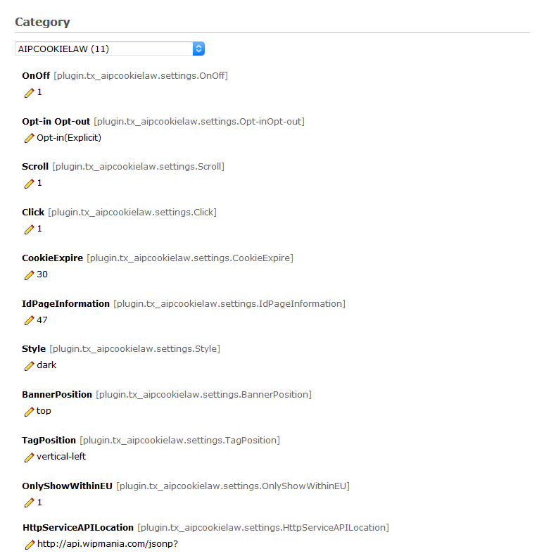

.. ==================================================
.. FOR YOUR INFORMATION
.. --------------------------------------------------
.. -*- coding: utf-8 -*- with BOM.

.. include:: ../../Includes.txt

.. _constants:

Constants
^^^^^^^^^

The constants properties can be defined by editing them with the Constant Editor.

#. Go to the module WEB > Template.

#. In the page tree, select a page where a TypoScript template is located, mostly the root page of your website.

#. In the upper left corner of the module, select 'Constant Editor' from the dropdown.

#. Under 'Category' select 'AIPCOOKIELAW(11)' from the dropdown.

   Editing properties in the Constant Editor

Of course you also can define the constants in the “Constants” field of your TypoScript templates.

.. _constants-plugin-aipcookielaw:

plugin.tx\_aipcookielaw.settings
""""""""""""""""""""""""""""""

.. _constants-plugin-aipcookielaw-settings:

OnOff
~~~~~~~~~~~~~~~~~

.. container:: table-row

   Property
         OnOff

   Data type
         boolean

   Description
         Activate/deactivate the banner with privacy info and consent button.

   Default
         1

OnOff Pop-up
~~~~~~~~~~~~~~~~~

.. container:: table-row

   Property
        OnOffPopUp

   Data type
        options

   Description
        Activate/deactivate the tab to open the privacy pop-up
        (to activate the privacy pop-up in a menu or anywhere else you can add add the attribute onclick="$('body').prepend(cc.showmodal) to a button or a link)
   Default
        1

Opt-in Opt-out
~~~~~~~~~~~~~~~~~

.. container:: table-row

   Property
        Opt-inOpt-out

   Data type
        options

   Description
        Set to explicit (Opt-in) or implicit (Opt-out) the consent required to close the banner.
        Implicit means that scroll (if active) the window or click (if active) anywhere it's enough to give the consent and close the banner.
        Possible values 'Opt-in(Explicit)','Opt-out(Implicit)'.

   Default
        Opt-in

Scroll
~~~~~~~~~~~~~~~~~

.. container:: table-row

   Property
        Scroll

   Data type
        boolean

   Description
         Activate/deactivate the scroll to close the banner (works only in Opt-out mode)

   Default
        1

Click
~~~~~~~~~~~~~~~~~

.. container:: table-row

   Property
        Click

   Data type
        boolean

   Description
         Activate/deactivate the click anywhere to close the banner (works only in Opt-out mode)

   Default
        1

CookieExpire
~~~~~~~~~~~~~~~~~

.. container:: table-row

   Property
        CookieExpire

   Data type
        int

   Description
        The duration of meta-cookie lifecycle in days

   Default
        30

Tracking ID (Google Analytics)
~~~~~~~~~~~~~~~~~

.. container:: table-row

   Property
        GATrackingId

   Data type
        string

   Description
        The Google Analytics Tracking ID (similar to UA-000000-2 )

   Default
        0

Anonymize IP (Google Analytics)
~~~~~~~~~~~~~~~~~

.. container:: table-row

   Property
        GAAnonymizeIp

   Data type
        boolean

   Description
        Configure the extension so that it anonymizes the IP address

   Default
        0

IdPageInformation
~~~~~~~~~~~~~~~~~

.. container:: table-row

   Property
        IdPageInformation

   Data type
        int

   Description
        Uid of the page which contains the privacy policy text

   Default
        0

GATrackingId
~~~~~~~~~~~~~~~~~

.. container:: table-row

   Property
        GATrackingId

   Data type
        string

   Description
         Google Analytics ID, if you set this constant, the google analytics code will be inserted in the page <head>. Leave it blank if you don't want it

   Default
        0

GAAnonymizeIp
~~~~~~~~~~~~~~~~~

.. container:: table-row

   Property
        GAAnonymizeIp

   Data type
        boolean

   Description
        Configure the IP anonymization of the google analytics code

   Default
        0

CssStyle
~~~~~~~~~~~~~~~~~

.. container:: table-row

   Property
        CssStyle

   Data type
        string

   Description
        location of the CSS file

   Default
        EXT:aip_cookie_law/Resources/Public/CSS/CookieLaw.css

Style
~~~~~~~~~~~~~~~~~

.. container:: table-row

   Property
        Style

   Data type
        options

   Description
        Skin style of the cookie law management frontend plugin.
        Possible values 'dark','light'.

   Default
        dark

BannerPosition
~~~~~~~~~~~~~~~~~

.. container:: table-row

   Property
        BannerPosition

   Data type
        options

   Description
        The position of the starting pop-up.
        Possible values 'top','bottom'.

   Default
        top

TagPosition
~~~~~~~~~~~~~~~~~

.. container:: table-row

   Property
        TagPosition

   Data type
        options

   Description
        The position of the tab button.
        Possible values 'bottom-right','bottom-left','vertical-right','vertical-left'.

   Default
        vertical-left

DontShowOnlyWithinEU
~~~~~~~~~~~~~~~~~

.. container:: table-row

   Property
        OnlyShowWithinEU

   Data type
        boolean

   Description
        Activate the window's geolocation functionality. If set to true (1) the banner works only within EU.

   Default
        1

HttpServiceAPILocation
~~~~~~~~~~~~~~~~~

.. container:: table-row

   Property
        HttpServiceAPILocation

   Data type
        string

   Description
        The url of the geolocation API service

   Default
        http://api.wipmania.com/jsonp?

