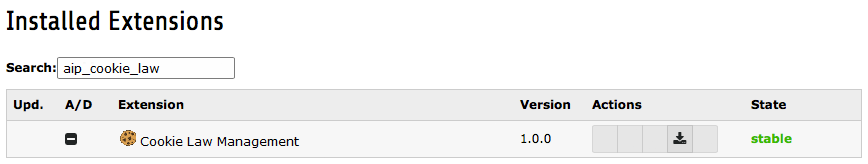

.. ==================================================
.. FOR YOUR INFORMATION
.. --------------------------------------------------
.. -*- coding: utf-8 -*- with BOM.

.. include:: ../Includes.txt

.. _installation:

Installation
------------

.. _extension-manager:

Extension Manager
^^^^^^^^^^^^^^^^^

#. Go to the module ADMIN TOOLS > Extensions.

#. In the upper left corner of the module, select 'Get Extensions' from the dropdown.

#. Click on the button 'Update now'. The list of available extensions on the TYPO3 Extension Repository (TER) will be
   downloaded. This can take a while.

#. When the list is downloaded, search for 'aip_cookie_law'.

#. Click on the '+' icon in front of the extension name. The extension will be installed.

   Verifying that aip_cookie_law is loaded in the Extension Manager

.. _web-template:

Web > Template
^^^^^^^^^^^^^^

.. note::

    No static template has to be included in a system template. This is done automatically by using
    ext_typoscript_constants.txt and ext_typoscript_setup.txt in the root of the extension. The settings will be loaded
    and Javascript and CSS will be included in the output.

.. _your-template:

    No need to manage your HTML template or your PAGE typoscript object. Banner and pop-ups are included via Javascript in the DOM.
